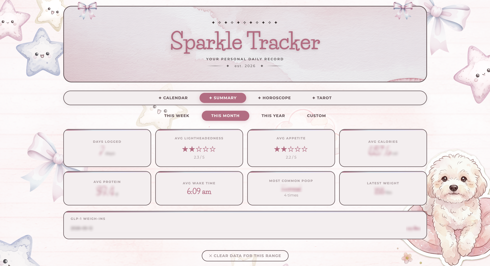
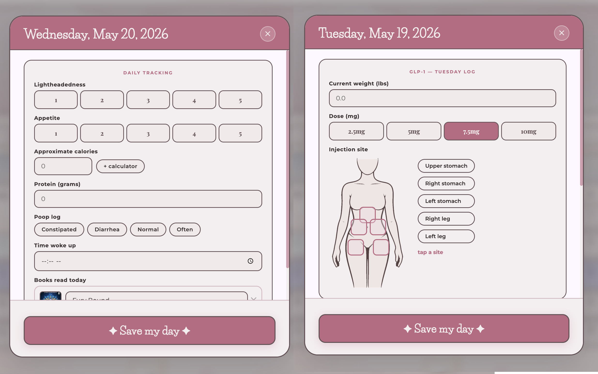

# Sparkle Tracker - My Own Personal Life Tracker

A personal habit, mood, and self-care tracker I built to make daily routines feel softer, more visual, and more encouraging.

Most productivity tools started to feel cold and clinical to me, so I wanted to create something that felt emotionally supportive instead of stressful. The goal was to make tracking daily life feel cozy, calming, and motivating while still giving useful structure and progress tracking underneath the surface.

This project became a mix of product design exploration, visual system design, UX experimentation, and AI-assisted rapid prototyping.

---

## The Problem

A lot of tracking apps feel overwhelming, rigid, or emotionally draining over time. I wanted something that still helped organize routines and daily habits without feeling like work every time I opened it.

I also wanted to explore how emotional design, softer visuals, gamification, and lightweight interactions could help reduce friction and make people more likely to return consistently.

---

## What I Designed

Sparkle Tracker includes:

- Daily mood and habit tracking
- A visual dashboard and progress summary
- Calendar tracking
- Gentle self-care focused UX patterns
- Tarot and horoscope inspired daily reflection features
- Soft visual rewards and cozy interface design
- Mobile-first responsive layouts

---

## API Integrations

I also explored external API integrations throughout the project to make the tracker feel more dynamic and personalized.

The horoscope feature pulls in live astrology data to generate daily horoscope content directly inside the app. I also experimented with book tracking integrations and calorie/protein calculator functionality to explore how lifestyle, wellness, and self-care tools could exist together in one experience.

A big focus here was learning how to connect APIs into real product workflows while still keeping the experience simple, cozy, and easy to use.

---

## My Role

I handled the full product direction, UX thinking, visual design, interface design, prototyping, interaction ideas, branding, and front-end implementation.

I also used AI-assisted workflows heavily throughout the process for ideation, prototyping, iteration, and rapid experimentation.

---

## Tools Used

- HTML, CSS, React, and JavaScript for the code  
- Vercel v0 for early prototyping and layout exploration  
- ChatGPT and Claude for iteration, UX exploration, and development support  
- VS Code for manual code editing and refinement  
- Cloudflare and Supabase for deployment and cloud data storage  
- Figma and Adobe tools for visual design exploration  

---

## Screenshots

### Calendar View

### Dashboard Summary

### Add / Daily Tracking

### Tarot Feature

### Horoscope Feature

---

## What I Learned

This project pushed me to think more deeply about emotional UX and how visual tone changes the way people interact with products over time.

It also helped me improve at rapid prototyping, responsive UI systems, component organization, and using AI tools as part of a real creative and product workflow instead of just a novelty.

A major focus throughout the project was balancing functionality with warmth. I wanted the interface to feel useful without losing personality or emotional comfort.

---

## What I’d Improve Next

- More customization options
- Better long-term trend visualization
- Expanded gamification and reward systems
- Accessibility improvements
- Native mobile app support
- Shared social or accountability features
